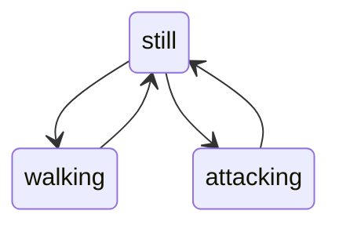

import { ApiLink } from '@site/src/components/api-link'
import { InheritedFrom } from '@site/src/components/inherited-from'
import { LabeledItem } from '@site/src/components/labeled-item'
import { MarkdownWrapper } from '@site/src/components/markdown-wrapper'
import { ObjectShapeDefinition } from '@site/src/components/object-shape-definition'
import {
  DoesNotReturnAnything,
  DoesNotTakeAnyParameters,
  Returns,
} from '@site/src/components/sentence-templates'
import { DataType, TypeDisplay } from '@site/src/components/type-display'
import { DocConstants } from '@site/src/constants'
import CodeInline from '@theme/CodeInline'

{/* Construction formula for this article: Copy everything from SimpleStateManager, then add <InheritedFrom> based on StateManager. */}

# SimpleFiniteStateManager

## Overview

<TypeDisplay>{DataType.class}</TypeDisplay>

<MarkdownWrapper>{DocConstants.TSDOC_DESC_SIMPLE_FINITE_STATE_MANAGER}</MarkdownWrapper>

```ts
class SimpleFiniteStateManager<State> extends SimpleStateManager<State> { }
```

### Constructor
```ts
constructor(
  defaultState: State,
  allowedStateTransitions: Array<[fromState: State, toState: State]>,
  options: SimpleStateManagerOptions
)
```

#### Parameters
<ObjectShapeDefinition
  data={[
    {
      name: 'defaultState',
      type: DataType.any,
      description: DocConstants.COMMON_DESC_DEFAULT_STATE,
    },
    {
      name: 'allowedStateTransitions',
      type: DataType.StateTransition,
      typeIsArrayOf: true,
      description: DocConstants.TSDOC_PARAM_DESC_ALLOWED_STATE_TRANSITIONS,
    },
    {
      name: 'options',
      type: DataType.SimpleStateManagerOptions,
      defaultValue: '`{}`',
      description: DocConstants.TSDOC_PARAM_DESC_STATE_MANAGER_OPTIONS_GENERAL,
    },
  ]}
/>

## Example

Consider an example where a playable character in a game:
- can stand be standing `still`, `walking`, or `attacking`;
- can perform an attack only when standing still.



<br/>

This would roughly translate into the following code:
```ts
import { SimpleFiniteStateManager } from '{:CORE_PACKAGE_NAME:}'

class PlayableCharacter {

  readonly state = new SimpleFiniteStateManager('still', [
    ['still', 'walking'],
    ['still', 'attacking'],
    ['walking', 'still'],
    ['attacking', 'still'],
  ], {
    name: 'PlayableCharacter',
  })

}
```

Since the initial state is `'still'`, changing the state to `'walking'` immediately after instantiating the class would be just fine.
```ts
const newCharacter = new PlayableCharacter()
newCharacter.set('walking')
newCharacter.set('attacking')
```

However, proceeding to change the state from `'walking'` to `'attacking'` would result in the following error:

> _InvalidStateTransitionError: from "walking" to "attacking" in PlayableCharacter_

<p>
  <LabeledItem label='Also see'>
    <ApiLink href='./InvalidStateTransitionError'>InvalidStateTransitionError</ApiLink>
  </LabeledItem>
</p>

## Properties

### defaultState

<InheritedFrom
  href={'./SimpleStateManager#defaultState'}
  name={'SimpleStateManager.defaultState'}
/>

<MarkdownWrapper>{DocConstants.COMMON_DESC_DEFAULT_STATE}</MarkdownWrapper>
```ts
readonly defaultState: State
```

### name

<InheritedFrom
  href={'./SimpleStateManager#name'}
  name={'SimpleStateManager.name'}
/>

<MarkdownWrapper>{DocConstants.TSDOC_DESC_OPTIONS_NAME}</MarkdownWrapper>
```ts
readonly name: string
```

## Methods

### get

<InheritedFrom
  href={'./SimpleStateManager#get'}
  name={'SimpleStateManager.get'}
/>

<MarkdownWrapper>{DocConstants.TSDOC_METHOD_DESC_GET}</MarkdownWrapper>
```ts
get(): State
```

#### Parameters
<DoesNotTakeAnyParameters name='get' />

#### Returns
<Returns name='get'>{DocConstants.RETURN_DESC_GET}</Returns>

#### Example
```js
const state = ExampleState.get()
```

### set

<InheritedFrom
  href={'./SimpleStateManager#set'}
  name={'SimpleStateManager.set'}
/>

<MarkdownWrapper>{DocConstants.TSDOC_METHOD_DESC_SET_BY_VALUE}</MarkdownWrapper>
```ts
set(newState: State): void
```
<MarkdownWrapper>{DocConstants.TSDOC_METHOD_DESC_SET_BY_FUNCTION}</MarkdownWrapper>
```ts
set(setStateFn: SetStateFn<State>): void
```

#### Parameters
`set` takes either one of the following parameters:
<ObjectShapeDefinition
  requireEitherOne
  data={[
    {
      name: 'newState',
      type: DataType.any,
      description: DocConstants.TSDOC_PARAM_DESC_SET_NEW_STATE,
    },
    {
      name: 'setStateFn',
      type: DataType.SetStateFn,
      description: DocConstants.TSDOC_PARAM_DESC_SET_FUNCTION,
    },
  ]}
/>

#### Returns
<Returns name='set'>{DocConstants.RETURN_DESC_SET}</Returns>

#### Example
```js
// Assuming that state is of type `number`
ExampleState.set(42)
ExampleState.set((previousState) => previousState + 1)
```

### reset

<InheritedFrom
  href={'./SimpleStateManager#reset'}
  name={'SimpleStateManager.reset'}
/>

<MarkdownWrapper>{DocConstants.TSDOC_METHOD_DESC_RESET}</MarkdownWrapper>
```ts
reset(): void
```

#### Parameters
<DoesNotTakeAnyParameters name='reset' />

#### Returns
<Returns name='reset'>{DocConstants.RETURN_DESC_RESET}</Returns>

#### Example
```js
ExampleState.reset()
```

### watch

<InheritedFrom
  href={'./SimpleStateManager#watch'}
  name={'SimpleStateManager.watch'}
/>

<MarkdownWrapper>{DocConstants.TSDOC_METHOD_DESC_WATCH}</MarkdownWrapper>
```ts
watch(callback: (state: State, eventType: StateChangeEventType) => void): () => void
```

#### Parameters
<ObjectShapeDefinition
  data={[{
    name: 'callback',
    type: DataType.Function,
    description: DocConstants.TSDOC_PARAM_DESC_WATCH_CALLBACK,
  }]}
/>

#### Returns
<Returns name='watch'>{DocConstants.RETURN_DESC_WATCH}</Returns>

#### Example
```js
const unwatch = ExampleState.watch((state) => { console.log(state) })
// ··· then after some time ···
unwatch()
```

### unwatchAll

<InheritedFrom
  href={'./SimpleStateManager#unwatchAll'}
  name={'SimpleStateManager.unwatchAll'}
/>

<MarkdownWrapper>{DocConstants.TSDOC_METHOD_DESC_UNWATCH_ALL}</MarkdownWrapper>
```ts
unwatchAll(): void
```

#### Parameters
<DoesNotTakeAnyParameters name='unwatchAll' />

#### Returns
<Returns name='unwatchAll'>{DocConstants.RETURN_DESC_UNWATCH_ALL}</Returns>

#### Example
```js
ExampleState.unwatchAll()
```

### wait
<MarkdownWrapper>{DocConstants.TSDOC_METHOD_DESC_WAIT_BY_VALUE}</MarkdownWrapper>
```ts
wait(expectedValue: State): Promise<State>
```
<MarkdownWrapper>{DocConstants.TSDOC_METHOD_DESC_WAIT_BY_EVALUATOR}</MarkdownWrapper>
```ts
wait(evaluator: WaitEvaluator<State>): Promise<State>
```

#### Parameters
`wait` takes either one of the following parameters:
<ObjectShapeDefinition
  requireEitherOne
  data={[
    {
      name: 'expectedValue',
      type: DataType.any,
      description: DocConstants.TSDOC_PARAM_DESC_WAIT_EXPECTED_VALUE,
    },
    {
      name: 'evaluator',
      type: DataType.WaitEvaluator,
      description: DocConstants.TSDOC_PARAM_DESC_WAIT_EVALUATOR,
    },
  ]}
/>

#### Returns
<Returns name='wait'>{DocConstants.RETURN_DESC_WAIT}</Returns>

#### Example
```js
// Promise will resolve when the state value becomes `42`.
await ExampleState.wait(42)

// Promise will resolve when the function returns `true`.
await ExampleState.wait((state) => fulfillsSomeCondition(state))
```

### dispose

<InheritedFrom
  href={'./SimpleStateManager#dispose'}
  name={'SimpleStateManager.dispose'}
/>

<MarkdownWrapper>{DocConstants.TSDOC_METHOD_DESC_DISPOSE_STATE_MANAGER}</MarkdownWrapper>
```ts
dispose(): void
```

#### Parameters
<DoesNotTakeAnyParameters name='dispose' />

#### Returns
<Returns name='dispose'>{DocConstants.RETURN_DESC_DISPOSE}</Returns>

#### Example
```js
ExampleState.dispose()
```
